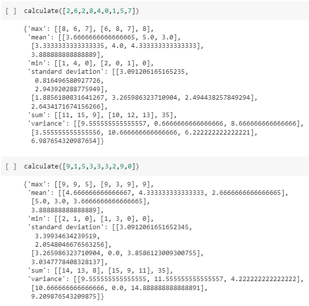

# Mean-Variance-Standard Deviation Calculator

- This python script calculates the sum, variance, standard deviation, max, min, and mean along both axes of a 3x3 matrix and for the flattened matrix.

Technologies used: Python, Numpy

# Live Version

https://colab.research.google.com/drive/1HFZ-B3R6B9UpO7xHyieWmCBYH-u4fyd8?usp=sharing



# Running Locally

To run this locally, run the following commands in a terminal:

```
python main.py
```

# Requirements

Create a function named calculate() in mean_var_std.py that uses Numpy to output the mean, variance, standard deviation, max, min, and sum of the rows, columns, and elements in a 3 x 3 matrix.

The input of the function should be a list containing 9 digits. The function should convert the list into a 3 x 3 Numpy array, and then return a dictionary containing the mean, variance, standard deviation, max, min, and sum along both axes and for the flattened matrix.

The returned dictionary should follow this format:

```
{
  'mean': [axis1, axis2, flattened],
  'variance': [axis1, axis2, flattened],
  'standard deviation': [axis1, axis2, flattened],
  'max': [axis1, axis2, flattened],
  'min': [axis1, axis2, flattened],
  'sum': [axis1, axis2, flattened]
}
```

If a list containing less than 9 elements is passed into the function, it should raise a ValueError exception with the message: "List must contain nine numbers." The values in the returned dictionary should be lists and not Numpy arrays.

For example, calculate([0,1,2,3,4,5,6,7,8]) should return:

```
{
  'mean': [[3.0, 4.0, 5.0], [1.0, 4.0, 7.0], 4.0],
  'variance': [[6.0, 6.0, 6.0], [0.6666666666666666, 0.6666666666666666, 0.6666666666666666], 6.666666666666667],
  'standard deviation': [[2.449489742783178, 2.449489742783178, 2.449489742783178], [0.816496580927726, 0.816496580927726, 0.816496580927726], 2.581988897471611],
  'max': [[6, 7, 8], [2, 5, 8], 8],
  'min': [[0, 1, 2], [0, 3, 6], 0],
  'sum': [[9, 12, 15], [3, 12, 21], 36]
}
```